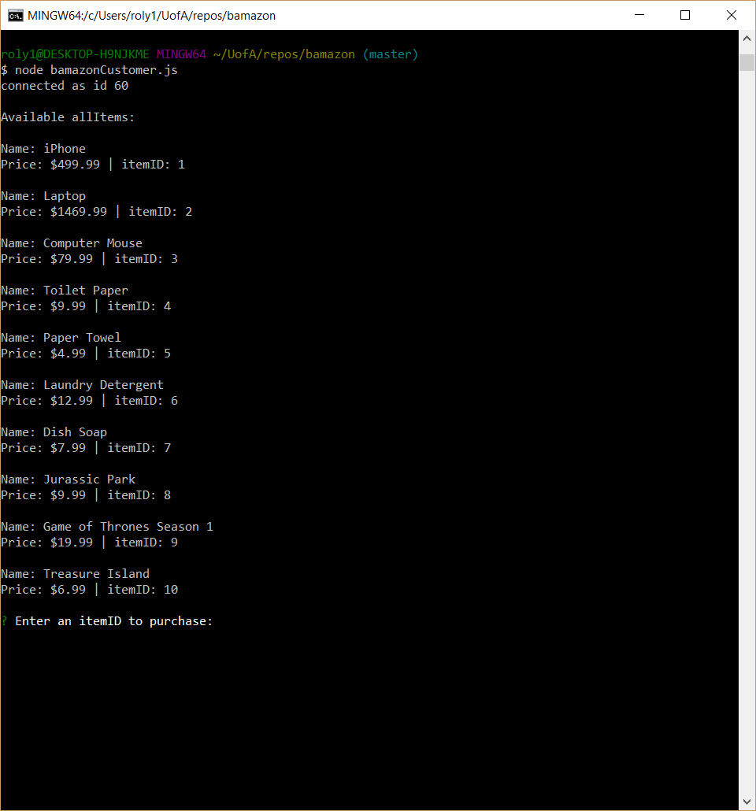
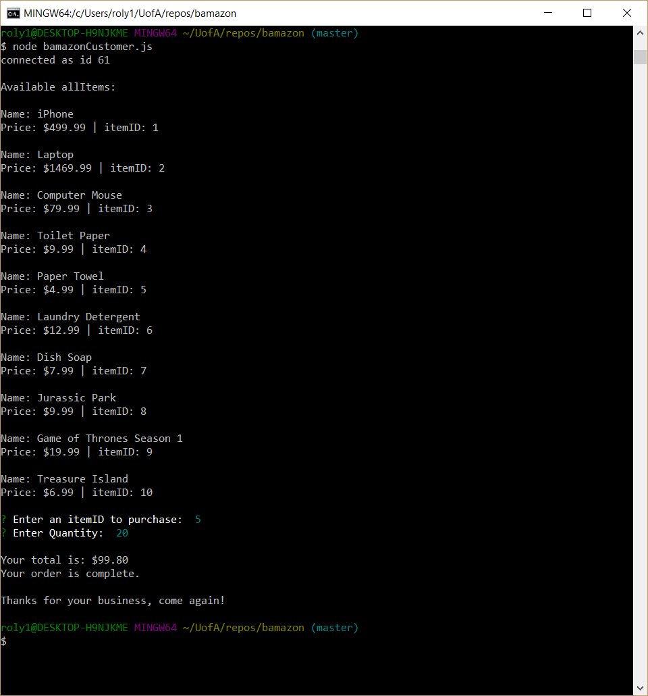
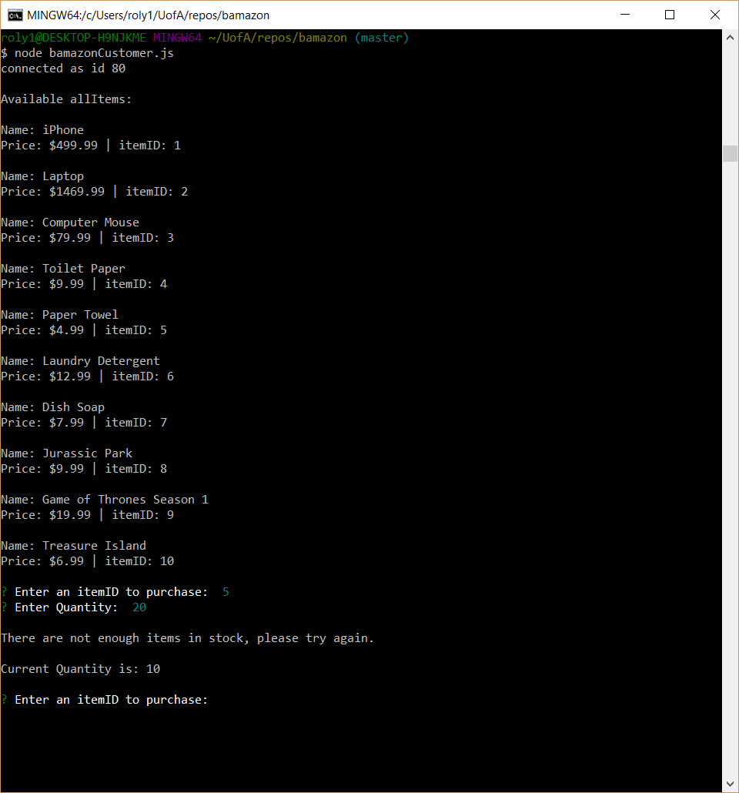
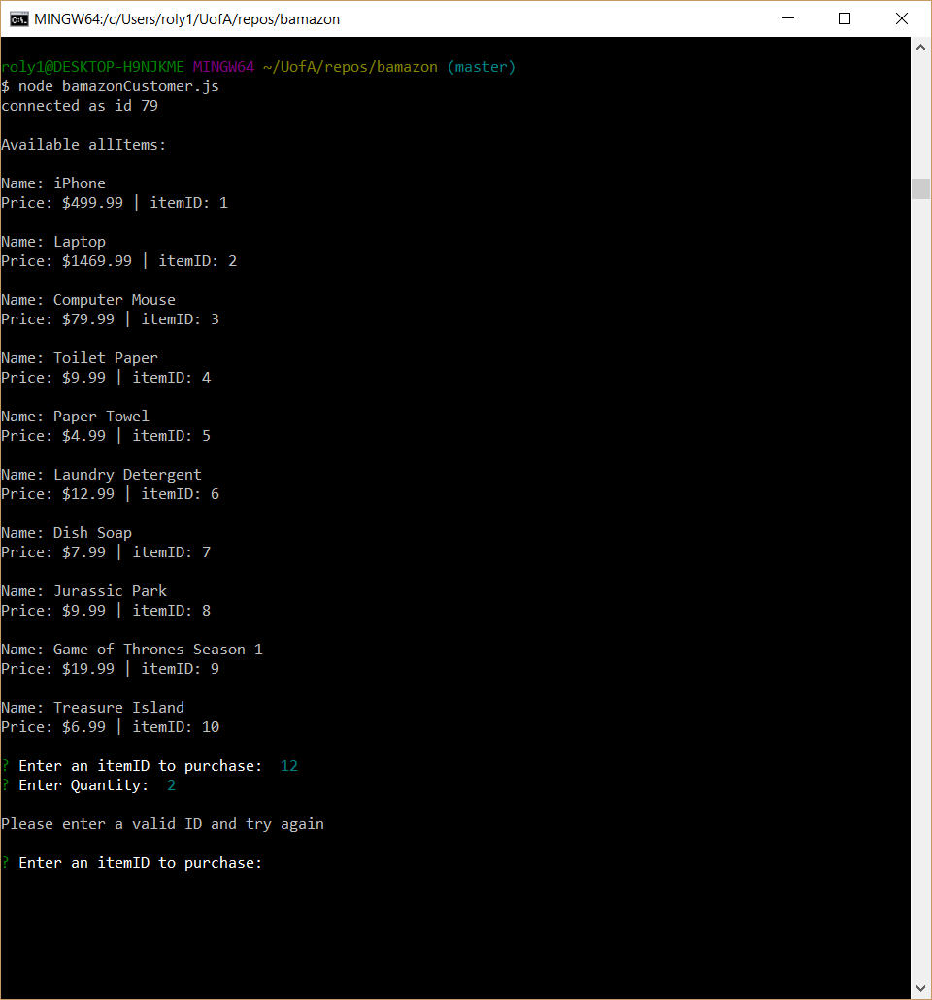

# **bamazonCustomer**

BamazonCustomer app allows you to see a list of available products for sale and allow the user to select and item and purchase a specific quantity if there are enough in stock.

------
## Purchase Complete

If the user enters all the correct information the app will calculate the number of items requested by the price and return a total.

------

## Insufficient Stock

If there is an insufficient stock the customer will receive a message and be prompted to try their purchase again.

------

## Incorrect ID

If the user enters an invalid item ID the program will prompt them to enter a valid ID and return to the prompt screen.

